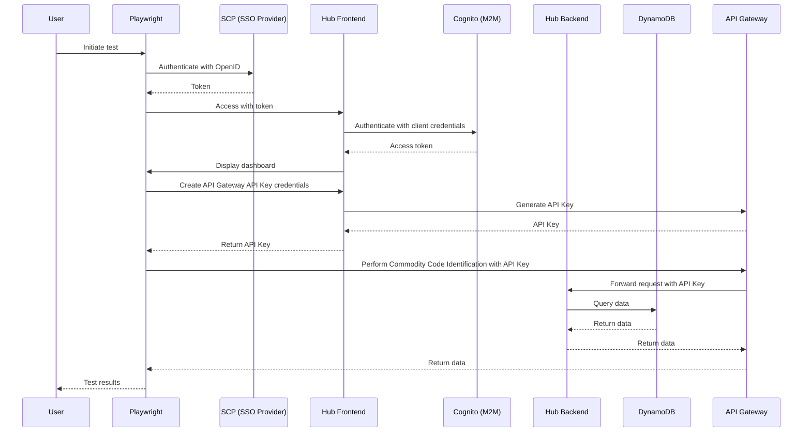

# trade-tariff-fpo-dev-hub-e2e

> Remember to install pre-commit hooks before making any changes to the repository.

Playwright suite used to validate the end to end functionality of the FPO dev hub

The hub service allows users to authenticate using their SCP logins and create
credentials in Api Gateway in order to make requests to the
Commodity Code Identification Tool (the protected resource).

The general flow that we're validating in this suite is as follows:



The hub frontend is accessible on the following URLs:

- [development][development-hub]
- [staging][staging-hub]
- [production][production-hub]

Implementation details for the frontend and backend can be reviewed, here:

- [frontend][frontend-github]
- [backend][backend-github]

[development-hub]: https://hub.dev.trade-tariff.service.gov.uk/
[staging-hub]: https://hub.staging.trade-tariff.service.gov.uk/
[production-hub]: https://hub.trade-tariff.service.gov.uk/
[frontend-github]: https://github.com/trade-tariff/trade-tariff-dev-hub-frontend
[backend-github]: https://github.com/trade-tariff/trade-tariff-dev-hub-backend

### Running tests locally
For the first time, run this command to install Chromium 
```
npx playwright install
```
### Running tests
```
npx playwright test
```
### Running tests in debug mode
```
npx playwright test --headed --debug
```