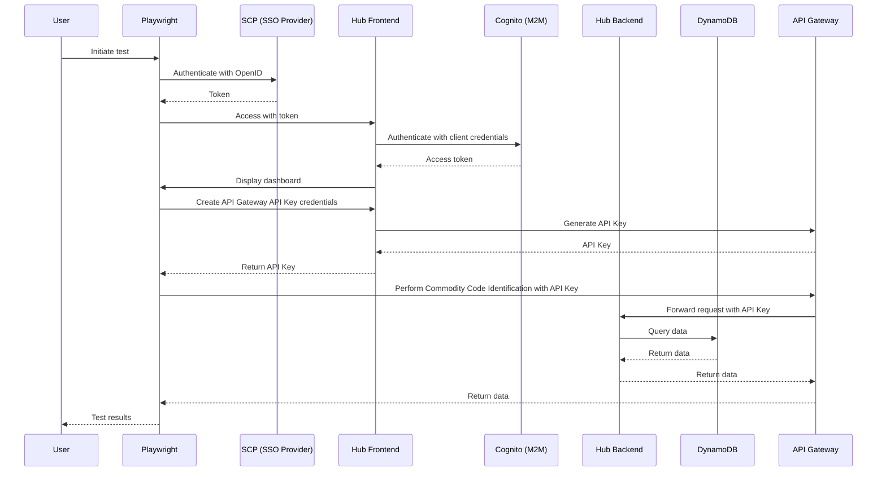

# trade-tariff-fpo-dev-hub-e2e

> Remember to install pre-commit hooks before making any changes to the repository.

Playwright suite used to validate the end to end functionality of the FPO dev hub

The hub service allows users to authenticate using their SCP logins and create
credentials in Api Gateway in order to make requests to the
Commodity Code Identification Tool (the protected resource).

The general flow that we're validating in this suite is as follows:



The hub frontend is accessible on the following URLs:

- [development][development-hub]
- [staging][staging-hub]
- [production][production-hub]

Implementation details for the frontend and backend can be reviewed, here:

- [frontend][frontend-github]
- [backend][backend-github]

[development-hub]: https://hub.dev.trade-tariff.service.gov.uk/
[staging-hub]: https://hub.staging.trade-tariff.service.gov.uk/
[production-hub]: https://hub.trade-tariff.service.gov.uk/
[frontend-github]: https://github.com/trade-tariff/trade-tariff-dev-hub-frontend
[backend-github]: https://github.com/trade-tariff/trade-tariff-dev-hub-backend

## Setup

### Prerequisites

- Node.js and Yarn installed
- AWS CLI configured with appropriate credentials
- Access to the S3 bucket for email fetching and lock management

### Installation

1. Install dependencies:
   ```bash
   yarn install
   ```

2. Install Playwright browsers:
   ```bash
   yarn run playwright install --with-deps chromium
   ```

3. Install pre-commit hooks:
   ```bash
   pre-commit install
   ```

## Running tests locally

### Environment Files

The project uses different `.env` files for different purposes:

- **`.env`** - For local secrets (personal credentials, local overrides)
- **`.env.development`** - Configuration for the development account (in the e2e project)
- **`.env.staging`** - Configuration for the staging account
- **`.env.production`** - Configuration for the production account (note: currently in a transitional state)

> **Security:** All `.env` and `.env.*` files are gitignored. Never commit them—they may contain bucket names, URLs, or secrets. Use `.env.example` only for non-secret template values.

### Setting up environment variables

You can set environment variables either by:

1. **Using environment files** (recommended):
   - Create a `.env` file for your local secrets
   - Create a `.env.development` file for development account configuration:
     ```bash
     URL=https://hub.dev.trade-tariff.service.gov.uk
     EMAIL_ADDRESS=your-email@example.com
     INBOUND_BUCKET=your-s3-bucket-name
     LOCK_KEY=locks/your-lock-key.lock
     ```

2. **Using export commands** in your shell:
   ```bash
   export URL=https://hub.dev.trade-tariff.service.gov.uk
   export EMAIL_ADDRESS=your-email@example.com
   export INBOUND_BUCKET=your-s3-bucket-name
   export LOCK_KEY=locks/your-lock-key.lock
   ```

**Required environment variables:**
- `URL` - The hub URL to test against
- `EMAIL_ADDRESS` - Email address for passwordless login flow
- `INBOUND_BUCKET` - S3 bucket name for email fetching and lock management
- `LOCK_KEY` - S3 key path for the distributed lock file

**AWS Credentials:**
You'll also need valid AWS credentials configured (via AWS CLI, `AWS_PROFILE`, or environment variables) to access the S3 bucket for email fetching and lock management.

### Quick Start for Local Development

1. Create a `.env` file for your local secrets (if needed)
2. Create a `.env.development` file with the development account configuration (see above)
3. Ensure AWS credentials are configured:
   ```bash
   aws sso login --profile <your-profile>
   export AWS_PROFILE=<your-profile>
   ```

## Running tests

```bash
yarn run test-development   # dev
yarn run test-staging       # staging
yarn run test --headed      # with browser visible
```

For a short “how the tests work” guide, see [docs/TESTS.md](docs/TESTS.md).

## Running tests in debug mode

```bash
yarn run playwright test --headed --debug
```

## Running tests in CI/GitHub Actions

For running tests in GitHub Actions, the following secrets need to be configured in the repository:

- `EMAIL_ADDRESS` - Email address for passwordless login flow
- `INBOUND_BUCKET` - S3 bucket name for email fetching and lock management
- `LOCK_KEY` - S3 key path for the distributed lock file

These secrets are automatically passed to the test execution via the workflow configuration.
